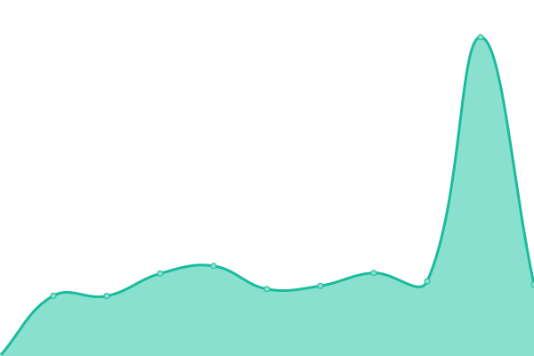
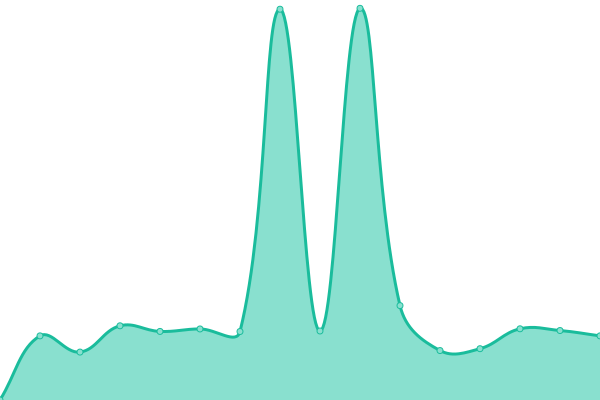

# [📈 Live Status](https://demo.upptime.js.org): <!--live status--> **🟧 Partial outage**

This repository contains the open-source uptime monitor and status page for [peymanahmadifar](https://demo.upptime.js.org), powered by [Upptime](https://github.com/upptime/upptime).

With [Upptime](https://upptime.js.org), you can get your own unlimited and free uptime monitor and status page, powered entirely by a GitHub repository. We use [Issues](https://github.com/peymanahmadifar/upptime/issues) as incident reports, [Actions](https://github.com/peymanahmadifar/upptime/actions) as uptime monitors, and [Pages](https://demo.upptime.js.org) for the status page.

<!--start: status pages-->
<!-- This summary is generated by Upptime (https://github.com/upptime/upptime) -->
<!-- Do not edit this manually, your changes will be overwritten -->
<!-- prettier-ignore -->
| URL | Status | History | Response Time | Uptime |
| --- | ------ | ------- | ------------- | ------ |
|  [MY](https://my.kheradedu.ir) | 🟩 Up | [my.yml](https://github.com/peymanahmadifar/upptime/commits/HEAD/history/my.yml) | 

 2832ms
     
 | 

<a href="https://peymanahmadifar.github.io/upptime/history/my">94.87%</a>
    

|  [my-dev](https://my-dev.kheradedu.ir) | 🟩 Up | [my-dev.yml](https://github.com/peymanahmadifar/upptime/commits/HEAD/history/my-dev.yml) | 

 2410ms
     
 | 

<a href="https://peymanahmadifar.github.io/upptime/history/my-dev">54.37%</a>
    

|  [my-dpi](https://dpi.kheradedu.ir/admin) | 🟩 Up | [my-dpi.yml](https://github.com/peymanahmadifar/upptime/commits/HEAD/history/my-dpi.yml) | 

 2794ms
     
 | 

<a href="https://peymanahmadifar.github.io/upptime/history/my-dpi">98.01%</a>
    

|  [registerhub-ui](https://kheradedu.com) | 🟩 Up | [registerhub-ui.yml](https://github.com/peymanahmadifar/upptime/commits/HEAD/history/registerhub-ui.yml) | 

 4336ms
     
 | 

<a href="https://peymanahmadifar.github.io/upptime/history/registerhub-ui">99.40%</a>
    

|  [registerhub-api](https://api.kheradedu.com/admin) | 🟩 Up | [registerhub-api.yml](https://github.com/peymanahmadifar/upptime/commits/HEAD/history/registerhub-api.yml) | 

 2983ms
     
 | 

<a href="https://peymanahmadifar.github.io/upptime/history/registerhub-api">99.28%</a>
    

|  [registerhub-dev-ui](https://dev.kheradedu.com) | 🟩 Up | [registerhub-dev-ui.yml](https://github.com/peymanahmadifar/upptime/commits/HEAD/history/registerhub-dev-ui.yml) | 

 3866ms
     
 | 

<a href="https://peymanahmadifar.github.io/upptime/history/registerhub-dev-ui">53.53%</a>
    

|  [registerhub-dpi](https://dpi.kheradedu.com/admin) | 🟥 Down | [registerhub-dpi.yml](https://github.com/peymanahmadifar/upptime/commits/HEAD/history/registerhub-dpi.yml) | 

 2966ms
     
 | 

<a href="https://peymanahmadifar.github.io/upptime/history/registerhub-dpi">99.39%</a>
    

|  [emdad-khodro](https://emdad-khodro-ardabil.ir) | 🟩 Up | [emdad-khodro.yml](https://github.com/peymanahmadifar/upptime/commits/HEAD/history/emdad-khodro.yml) | 

 4303ms
     
 | 

<a href="https://peymanahmadifar.github.io/upptime/history/emdad-khodro">96.05%</a>
    

|  [khodrobar](https://khodrobar-ardabil.ir) | 🟩 Up | [khodrobar.yml](https://github.com/peymanahmadifar/upptime/commits/HEAD/history/khodrobar.yml) | 

 3437ms
     
 | 

<a href="https://peymanahmadifar.github.io/upptime/history/khodrobar">95.78%</a>
    

<!--end: status pages-->

[**Visit our status website →**](https://demo.upptime.js.org)

## 📄 License

- Powered by: [Upptime](https://github.com/upptime/upptime)
- Code: [MIT](./LICENSE) © [Anand Chowdhary](https://anandchowdhary.com), supported by [Pabio](https://pabio.com)
- Data in the `./history` directory: [Open Database License](https://opendatacommons.org/licenses/odbl/1-0/)
